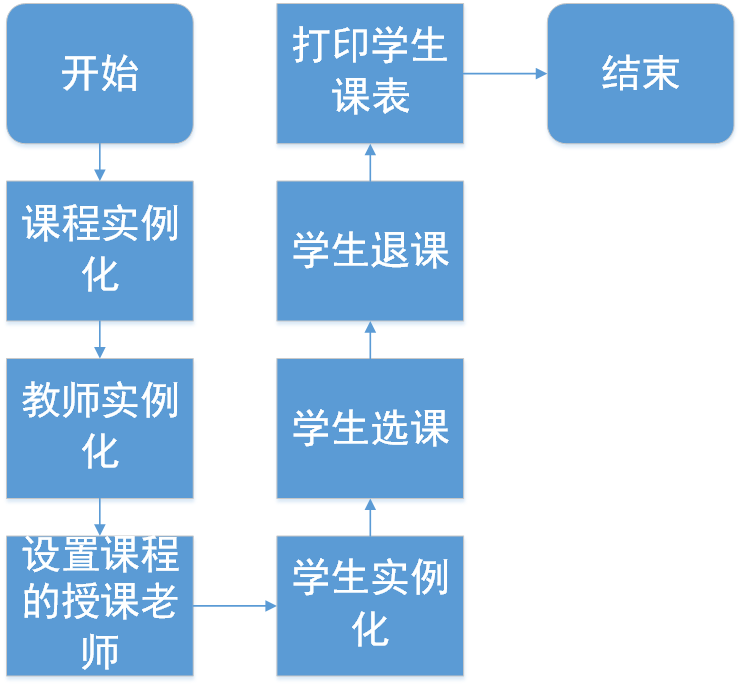

# 实验二 学生模拟选课系统
### 一、实验目的
1. 初步了解分析系统需求，从学生选课角度了解系统中的实体及其关系，学会定义类中的属性以及方法；
2. 掌握面向对象的类设计方法（属性、方法）；
3. 掌握通过构造方法实例化对象；
4. 学会使用数组。
### 二、要求
#### 业务要求
学校人员分为“教师”和“学生”，教师教授“课程”，学生选择“课程”。每名教师可讲授多门课程，每名学生可选修多门课程。

多门课程，可用课程数组形式表达。

对象：教师（编号、姓名、性别、所授课程）

学生（编号、姓名、性别、所选课程）

课程（编号、课程名称、上课地点、时间、授课教师）

#### 实验要求
1. 编写上述实体类以及测试主类
2. 在测试主类中，实例化多个类实体，模拟

    1）教师开设某课操作；

    2）学生选课操作、退课操作

    3）打印学生课表信息（包括：编号、课程名称、上课地点、时间、授课教师）

3. 编写实验报告。

### 三、程序设计过程
1. 首先阅读题目，分析出所需要三个对象，即教师、学生、课程。因此定义四个类：Teacher类、Student类、Course类、XuankeSystem类。
2. 在分析三个对象之间的关系之前，先为测试类XuankeSystem外的三个类添加属性和方法。Teacher类属性：number、name、sex、course。
Student类属性：number、name、sex、course，Student类方法：xuanke、tuike。Course类属性：number、name、place、time、teacher，Course类方法：setTeacher。另外这三个类都有对应的构造方法，作用是在测试类实例化时将实参赋值给变量。
3. 由要求中的选课操作，可以在student类中添加一个xuanke方法，形参为课程数组，利用for循环将课程赋值给数组中的元素。 
4. 由要求中的退课操作，可以在Student类中添加一个tuike方法，形参为课程。利用for循环遍历数组，当要退课的名称和数组中课程名称相等的时候，将该位置的课程等于后一位课程。最终达到从该课程位置开始，后面所有课程前移的效果，并将要退的课程覆盖；但执行完后数组最后两个课程是一模一样的，因此用数组缩容，将最后一个课程缩掉。
5. 在测试类中实例化六个课程：高等数学、线性代数、java、c语言、大学物理、体育。实例化四个教师：王老师、张老师、李老师、石老师，并将实例化的课程作为实参，当作教师的所授课程。
6. 在Course类中添加一个setTeacher方法，形参为教师。将实参赋值给Course类中的属性teacher。目的是设置该课程的授课教师。
7. 在测试类中分别调用各课程的setTeacher，设置实参作为授课教师。
8. 实例化两个学生
9. 调用两位同学的xuanke方法，设置实参为要选的课程。调用tuike方法，设置实参作为要退的课程。
10. 输出学生信息，再利用for循环遍历该学生的课程数组，输出各课程的信息。

### 四、流程图

### 五、关键代码
1. Teacher类，添加了number、name、sex、course四个属性，并定义构造方法将参数赋值给属性。
```java
public class Teacher{
    String number;
    String name;
    String sex;
    Course[] course;
    Teacher(String a,String b,String c,Course[] d){
        number=a;
        name=b;
        sex=c;
        course=d;
    }
}
```
2. Student类，添加了number、name、sex、course四个属性，并定义构造方法将参数赋值给属性。
```java
public class Student{
    String number;
    String name;
    String sex;
    Course[] course;
    Student(String a,String b,String c,Course[] d){
        number=a;
        name=b;
        sex=c;
        course=d;
    }
```
3.选课操作，添加一个xuanke方法，形参为课程数组，利用for循环将课程赋值给数组中的元素。
```java
   //选课
    void xuanke(Course t) {
        for(int i=0;i<this.course.length;i++){
	    if (course[i]==null) {
	    	course[i]=t;
	    	break;
	    }
	}
    }
```
4. 退课操作，利用for循环遍历数组，当要退课的名称和数组中课程名称相等的时候，将该位置的课程等于后一位课程。最终达到从该课程位置开始，后面所有课程前移的效果，并将要退的课程覆盖；但执行完后数组最后两个课程是一模一样的，因此用数组缩容，将最后一个课程缩掉。
```java
    //退课
    void tuike(Course t){
        for(int i=0;i<this.course.length;i++){
            if(Objects.equals(t.name, course[i].name)){
                for(int j=1;j<this.course.length-i;j++){
                    course[i+j-1]=course[i+j];
                }
                course = Arrays.copyOf(course, course.length-1);
            }
        }
    }
```
5.Student类，添加了number、name、place、time、teacher五个属性，并定义构造方法将参数赋值给属性。

setTeacher方法，设置该课程的教师。
```java
public class Course{
    String number;
    String name;
    String place;
    String time;
    Teacher teacher;
    Course(String a,String b,String c,String d){
        number=a;
        name=b;
        place=c;
        time=d;
    }
    public void setTeacher(Teacher t){
        this.teacher=t;
    }
}
```
6.XuankeSystem类，进行了六个课程的实例化、四个教师的实例化、两个学生的实例化；设置了六个课程的老师，进行了三次学生退课。最后打印课表。
```java
public class XuankeSystem {
    public static void main(String[] args) {
        //课程实例化
        Course gdsx=new Course("001","高等数学","教101","周一8：00——9：40");
        Course xxds=new Course("002","线性代数","教102","周二8：00——9：40");
        Course java=new Course("003","Java","教201","周三1：30——3：10");
        Course cyy=new Course("004","C语言","教202","周四1：30——3：10");
        Course dxwl=new Course("005","大学物理","教203","周五8：00——9：40");
        Course tiyu=new Course("006","体育","体育馆","周五10：00——11：40");

        //教师实例化
        Teacher wang=new Teacher("0001","王老师","男", new Course[]{gdsx,xxds});
        Teacher zhang=new Teacher("0002","张老师","男",new Course[]{java,cyy});
        Teacher li=new Teacher("0003","李老师","女",new Course[]{dxwl});
        Teacher shi=new Teacher("004","石老师","男",new Course[]{tiyu});

        //设置课程的教师
        gdsx.setTeacher(wang);
        xxds.setTeacher(wang);
        java.setTeacher(zhang);
        cyy.setTeacher(zhang);
        dxwl.setTeacher(li);
        tiyu.setTeacher(shi);
        
        //学生实例化
        Student liu=new Student("202001","刘同学","男",new Course[]{gdsx,xxds,cyy,java,dxwl});
        Student zhao=new Student("202002","赵同学","女",new Course[]{xxds,java,cyy,dxwl,tiyu,gdsx});

        //学生选课操作
        liu.xuanke(gdsx);
        liu.xuanke(xxds);
        liu.xuanke(java);
        zhao.xuanke(cyy);
        zhao.xuanke(dxwl);
        zhao.xuanke(tiyu);
        
        //学生退课操作
        liu.tuike(gdsx);
        zhao.tuike(cyy);

        //打印课表
        System.out.println("学生编号:"+liu.number+
                "\n学生姓名:"+liu.name+
                "\n学生性别:"+liu.sex);

        for(int i = 0; i<liu.course.length; i++){
            System.out.println("课程编号:"+liu.course[i].number+"\t课程名称:"+liu.course[i].name+"\t上课时间:"
                    +liu.course[i].time+"\t上课地点:"+liu.course[i].place+"\t教师:"+liu.course[i].teacher.name);
        }

        System.out.println("\n"+"学生编号:"+zhao.number+
                "\n学生姓名:"+zhao.name+
                "\n学生性别:"+zhao.sex);

        for(int i = 0; i<zhao.course.length; i++){
            System.out.println("课程编号:"+zhao.course[i].number+"\t课程名称:"+zhao.course[i].name+"\t上课时间:"
                    +zhao.course[i].time+"\t上课地点:"+zhao.course[i].place+"\t教师:"+zhao.course[i].teacher.name);
        }
    }
}
```
### 六、系统运行截图

### 七、感想与体会
通过本次实验提高了分析系统需求，从而进行程序设计的能力；理清了学生选课过程业务逻辑关系；熟练掌握定义以及调用类中的属性以及方法，面向对象的类设计方法（属性、方法）；学会使用数组等。

我认为要通过题目来分析出程序需要设计几个类，每个类中需要什么属性，然后通过创建构造方法以及设置参数的形式来将课程、教师或者学生的信息录入。实验中我认为比较有难度的点是退课操作，我运用的方法是数组前移并且数组缩容。

在实验中也遇到了很多bug，但是都在老师的指导、自己的调整下解决了，提高了很多自己的能力。最后我希望能更多了解到java的编程知识，让我的程序设计能够变得更丰富更多样化。